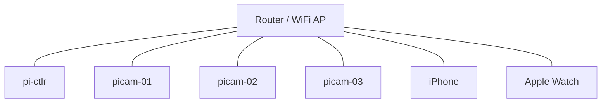
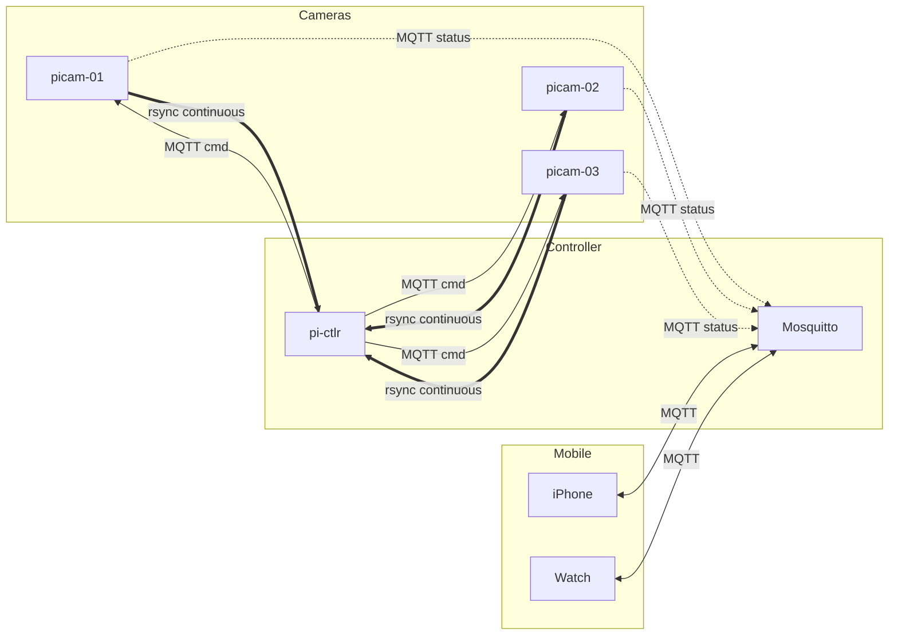

# System Design

## Overview

Multi-device recording system coordinated by a Pi controller. All devices record synchronously under a shared session UUID.

## Network



### Data Flow



All devices connect via WiFi to a local router. The `pi-ctlr` runs the Mosquitto MQTT broker. Remote access via **Tailscale VPN**.

## Devices

| ID | Hardware | Role |
|----|----------|------|
| `pi-ctlr` | Pi 4 | Session authority, MQTT broker, data aggregation |
| `picam-01` | Pi Zero 2 | 1080p video, 360p live stream |
| `picam-02` | Pi Zero 2 | 1080p video, 360p live stream |
| `picam-03` | Pi Zero 2 | 1080p video, 360p live stream |
| `phone` | iPhone | Sensor recording, user UI |
| `watch` | Apple Watch | Sensor recording, user UI |
| `sensor` | Pi 4 onboard | CAN, GNSS, IMU |

## Session Lifecycle

```
idle → preflight → recording → idle
```

1. **Start** — User taps start on phone/watch
2. **Preflight** — pi-ctlr generates UUID, all devices confirm ready
3. **Recording** — pi-ctlr sends `session/start` with `start_time` (+5s buffer)
4. **Stop** — All devices stop, pi-ctlr triggers rsync + upload

### Crash Recovery

Retained topics `session/state` and `session/last` allow devices to rejoin an active session on reconnect.

## Storage

| Device | Format | Notes |
|--------|--------|-------|
| `picam-*` | MP4 H.264, 30-60s snippets | Continuous rsync to pi-ctlr |
| `phone` / `watch` | SQLite | `timestamp, recording_id, sensor_type, value` |
| `sensor` | SQLite or CSV | Same schema |
| `pi-ctlr` | Folder per `recording_id` | Aggregates all video + sensor DBs |

### Rsync (Continuous)

Rsync runs continuously in the background on each picam node, independent of recording state. This ensures video snippets are transferred to pi-ctlr as soon as they're written, freeing up SD card space.

```bash
# Runs on each picam node (cron or systemd timer)
rsync -av --remove-source-files /home/pi/videos/ pi-ctlr:/mnt/videos/picam-01/
```

- **Not session-triggered** — always running
- **Deletes source on success** — keeps picam storage free
- **Fault tolerant** — resumes on reconnect
