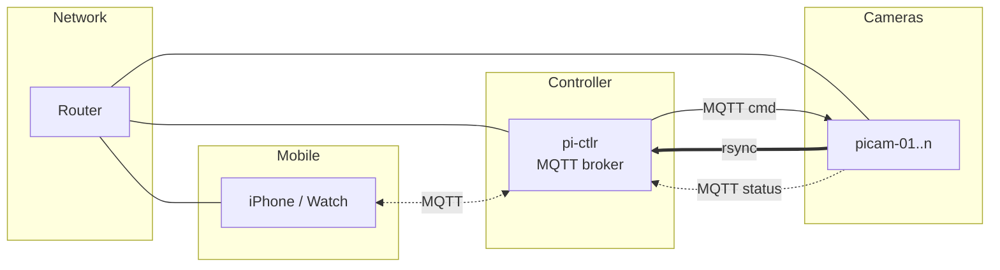

# System Design

## Overview

Multi-device recording system coordinated by a Pi controller. All devices record synchronously under a shared session UUID.

## Network



All devices connect via WiFi to a local router. The `pi-ctlr` runs the Mosquitto MQTT broker. Remote access via **Tailscale VPN**.

## Devices

| ID | Hardware | Role |
|----|----------|------|
| `pi-ctlr` | Pi 4 | Session authority, MQTT broker, data aggregation |
| `picam-01..n` | Pi Zero 2 | 1080p video, 360p live stream (scalable) |
| `phone` | iPhone | Sensor recording, user UI |
| `watch` | Apple Watch | Sensor recording, user UI |
| `sensor` | Pi 4 onboard | CAN, GNSS, IMU |

## Session Lifecycle

```
idle → preflight → recording → idle
```

1. **Start** — User taps start on phone/watch
2. **Preflight** — pi-ctlr generates UUID, all devices confirm ready
3. **Recording** — pi-ctlr sends `session/start` with `start_time` (+5s buffer)
4. **Stop** — All devices stop recording

### Crash Recovery

Retained topics `session/state` and `session/last` allow devices to rejoin an active session on reconnect.

## Background Processes

These run continuously, independent of session state:

| Process | Where | Description |
|---------|-------|-------------|
| Rsync | picam → pi-ctlr | Transfers video snippets, deletes on success |
| MQTT heartbeat | all devices | Connection keepalive |
| Cloud upload | pi-ctlr | Uploads completed sessions to cloud |

## Storage

| Device | Format | Notes |
|--------|--------|-------|
| `picam-*` | MP4 H.264, 30-60s snippets | Continuous rsync to pi-ctlr |
| `phone` / `watch` | SQLite | `timestamp, recording_id, sensor_type, value` |
| `sensor` | SQLite or CSV | Same schema |
| `pi-ctlr` | Folder per `recording_id` | Aggregates all video + sensor DBs |
