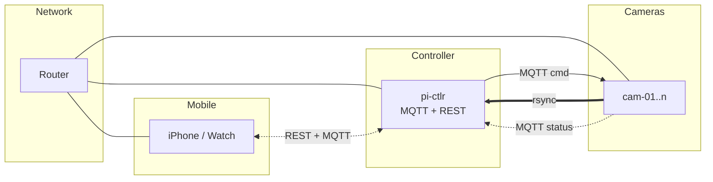
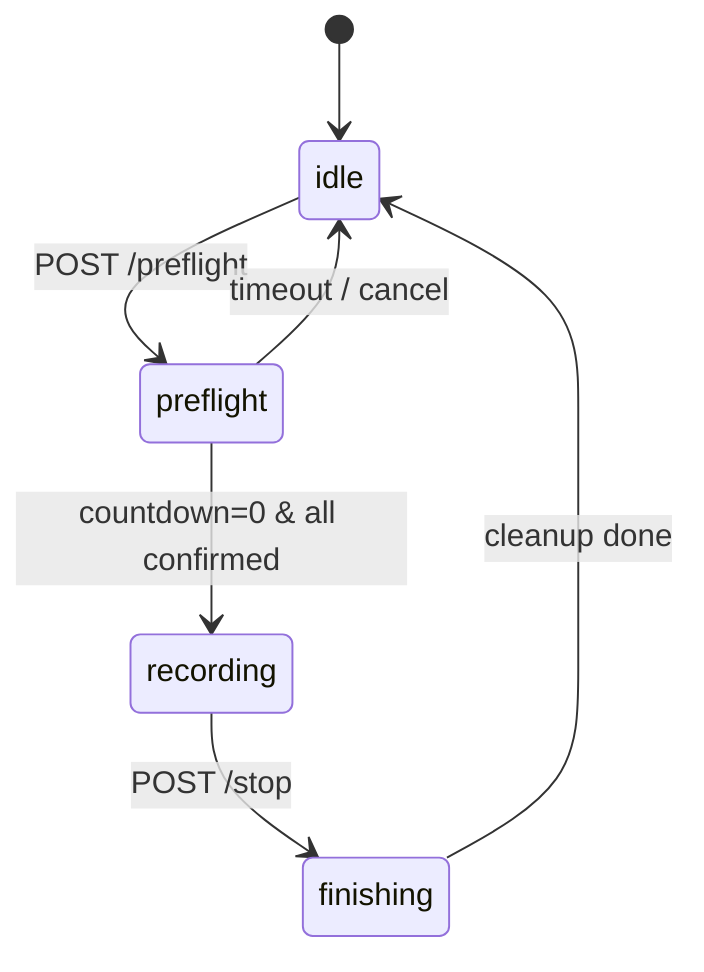
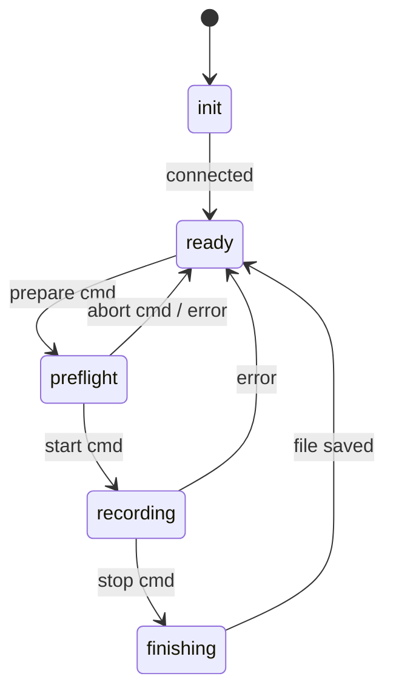

# System Design

## Overview

Multi-device recording system coordinated by a Pi controller. All devices record synchronously under a shared session UUID.

## Network



All devices connect via WiFi. The `pi-ctlr` runs Mosquitto MQTT broker and FastAPI REST server. Remote access via **Tailscale VPN**.

## Devices

| ID | Hardware | Role |
|----|----------|------|
| `pi-ctlr` | Pi 4 | Session authority, MQTT broker, REST API |
| `cam-01..n` | Pi Zero 2 | Video recording (scalable) |
| `phone` | iPhone | User UI, session control |

---

## State Machines

### Controller



| State | Description |
|-------|-------------|
| `idle` | No active session. Ready to start preflight. |
| `preflight` | Waiting for node confirmations and countdown. |
| `recording` | Active recording session. |
| `finishing` | Cleaning up, flushing buffers, closing files. |

### Camera Node



| State | Description |
|-------|-------------|
| `init` | Hardware initialization, MQTT connection |
| `ready` | Idle, publishing health, awaiting commands |
| `preflight` | Running checks, confirming readiness |
| `recording` | Capturing video, publishing status |
| `finishing` | Finalizing file, flushing buffers |

---

## Session Flow

1. **User starts session** → `POST /preflight` with node list
2. **Controller** → publishes `prepare` command, starts countdown
3. **Each node** → runs preflight checks, publishes `ready`
4. **Countdown = 0** → controller publishes `start`
5. **All nodes record** → publish status periodically
6. **User stops** → `POST /stop`, controller publishes `stop`
7. **Nodes finish** → finalize files, return to ready

## Error Handling

- **Node failure**: Isolated — does not affect other nodes
- **Fatal error**: Stop recording → finalize file → publish error → return to ready
- **Controller tracks**: Which nodes are healthy vs failed per session

## Background Processes

These run continuously, independent of session state:

| Process | Where | Description |
|---------|-------|-------------|
| Rsync | cam → pi-ctlr | Transfers video files |
| Status publish | all nodes | Health + telemetry |
| Cloud upload | pi-ctlr | Uploads completed sessions |

## File Naming

```
{session_uuid}_{node_id}.mp4
```

Example: `db654093-03fc-42cf-bcd4-f072232fac96_cam-01.mp4`
